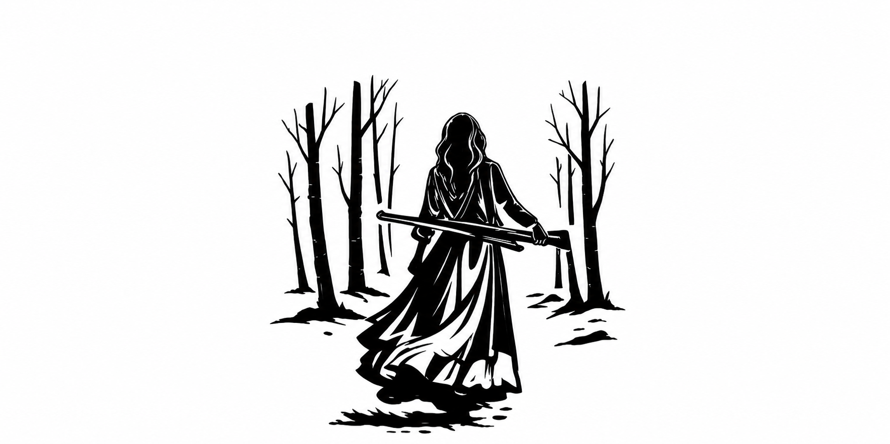

<picture>
  <source media="(prefers-color-scheme: dark)" srcset="./assets/iwoss-banner-dark.png">
  <source media="(prefers-color-scheme: light)" srcset="./assets/iwoss-banner-light.png">
  
</picture>

<h1 align="center">IWOSS / iwosw</h1>

  <b>Java / Minecraft mod developer — Forge & NeoForge</b> 
  I build mods and server tools around the problems I actually run into while running a live Minecraft server.

  <a href="https://github.com/iwosw?tab=repositories">Repositories</a> ·
  <a href="https://www.curseforge.com/members/iwoss/projects">CurseForge</a> ·
  <a href="https://modrinth.com/user/IWOSS_">Modrinth</a>

  
  
  
  

---

## About

I work mostly in Java 21 on Minecraft mods for Forge and NeoForge. Running a live server gives me real problems to solve: compatibility, security, world rules, and mechanics that have to survive actual players.

I use AI tools for boilerplate, unfamiliar APIs, and review — but I read, run, and debug everything before it ships.

**Currently learning:** mixins, custom payload networking, and better automated tests for mod logic.

## Tech

Learning on the side:

---

## Published

The main projects I maintain and release for other people to use.

[**Recruits Use Boomsticks**](https://github.com/iwosw/recruits-use-boomsticks) — Forge 1.20.1 compatibility mod that lets Villager Recruits crossbowmen use Medieval Boomsticks weapons. Available on [CurseForge](https://www.curseforge.com/minecraft/mc-mods/recruits-use-boomsticks) and [Modrinth](https://modrinth.com/mod/recruits-use-boomsticks).

[**Server Login**](https://github.com/iwosw/server-login) — server-only password authentication for offline-mode Forge servers. Available on [CurseForge](https://www.curseforge.com/minecraft/mc-mods/server-login).

[**Workers Ore Compat**](https://github.com/iwosw/workers-ore-compat) — configurable ore recognition and pickup for Villager Workers miners. Available on [CurseForge](https://www.curseforge.com/minecraft/mc-mods/workers-ore-compat).

## Other public work

[**SafeStep**](https://github.com/iwosw/SafeStep) — React / Vite / TypeScript digital-hygiene learning hub.

[**Unified-State-Exam-CS**](https://github.com/iwosw/Unified-State-Exam-CS) — static study site for the Russian CS exam (ЕГЭ).

## In progress

Alpha or experimental projects. Expect changing APIs, incomplete content, and rough edges.

[**Vivarium Libera**](https://github.com/iwosw/Vivarium-Libera) — NeoForge nature and herbalism expansion.

[**Millenaire Universalis**](https://github.com/iwosw/millenaire-universalis) — NeoForge addon focused on factions, armies, logistics, and realms.

[**Animalis Agricultura**](https://github.com/iwosw/animalis-agricultura) — livestock simulation for breeding, feeding, pregnancy, and inherited variants.

[**Cultio**](https://github.com/iwosw/cultio) — agriculture overhaul with seasons, crop disease, rotation, and weeds.

[**Nature**](https://github.com/iwosw/nature) — NeoForge terrain generation experiment with a Rust/JNI backend.

[**Caelum**](https://github.com/iwosw/caelum) — server-side skybase and world-integrity detection.

[**Lumen et Signum**](https://github.com/iwosw/lumen-et-signum) — Rust desktop control panel and ESP32 companion firmware.

[**Consilium Regum**](https://github.com/iwosw/consilium-regum) — experimental AI control layer for WorldBox.

---

  <i>«Взял GT-63, мне нужно ехать быстро.»</i> 
  - IWOSS 
   
  or 
   
  <i>"Close my eyes feel a silhouette over me, all over me."</i> 
  - IWOSS

